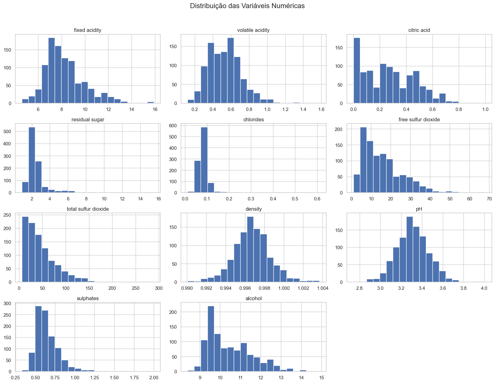
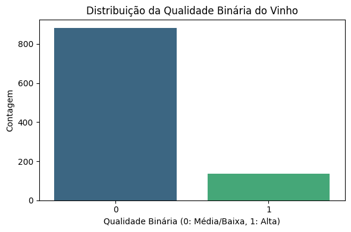
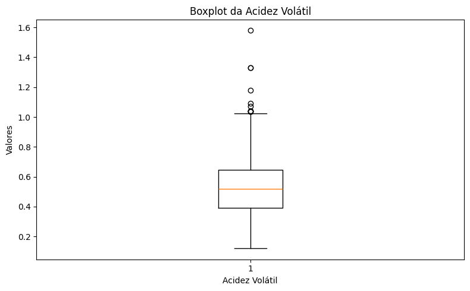
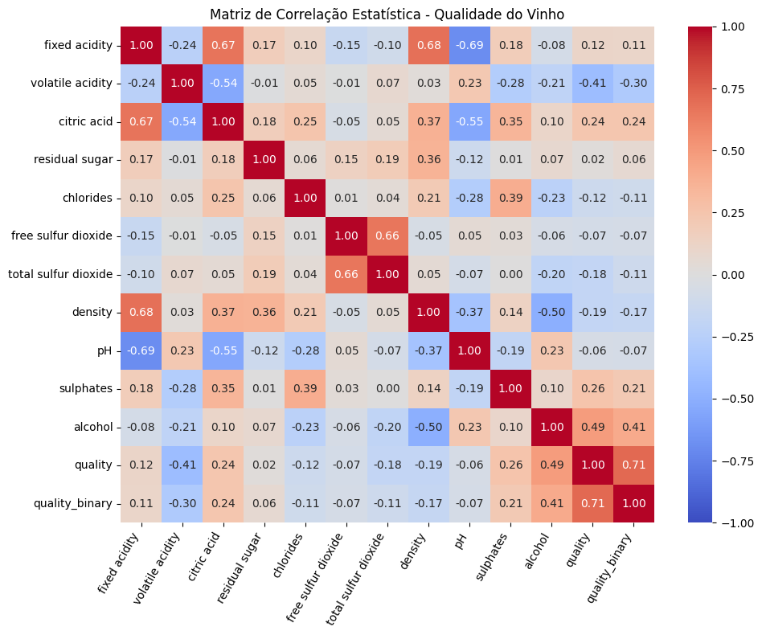
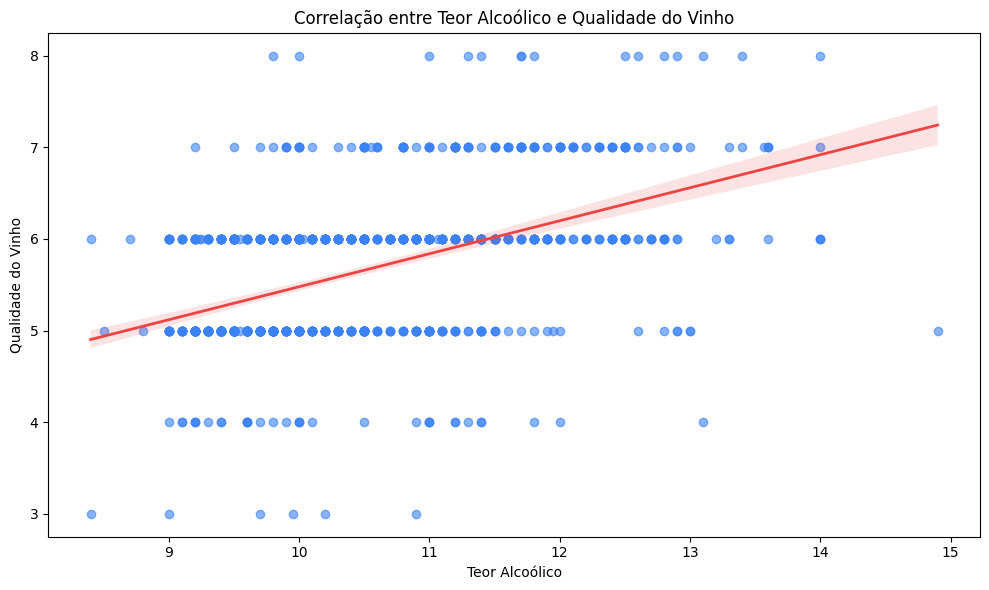
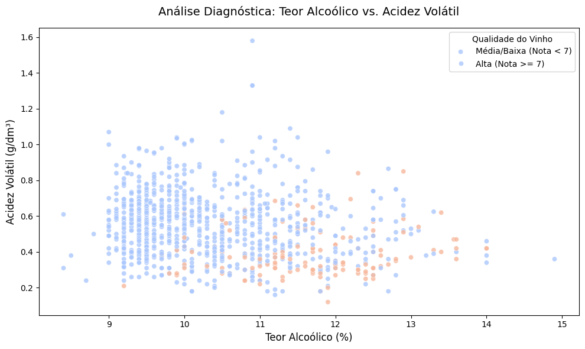
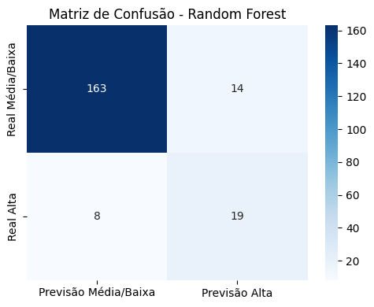
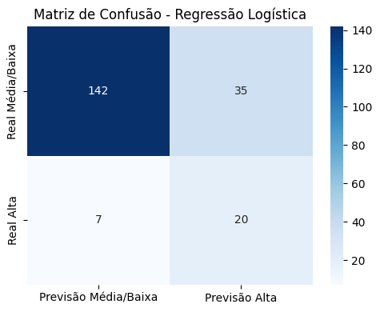
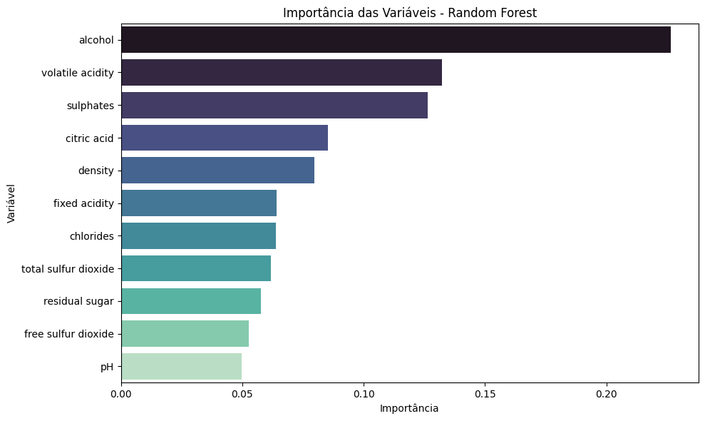

# Tech Challenge — Fase 2
# Classificando a Qualidade de Vinhos com Machine Learning

**Curso:** Pós-Graduação em Data Analytics — FIAP  
**Dataset:** Wine Quality Dataset (Kaggle — `yasserh/wine-quality-dataset`)

---

## Sumário

1. [Introdução](#1-introdução)
2. [Compreensão e Preparação dos Dados](#2-compreensão-e-preparação-dos-dados)
3. [Análise Exploratória de Dados (EDA)](#3-análise-exploratória-de-dados-eda)
4. [Pré-processamento de Dados](#4-pré-processamento-de-dados)
5. [Desenvolvimento dos Modelos](#5-desenvolvimento-dos-modelos)
6. [Avaliação dos Modelos](#6-avaliação-dos-modelos)
7. [Interpretação dos Resultados](#7-interpretação-dos-resultados)
8. [Conclusão](#8-conclusão)

---

## 1. Introdução

A avaliação da qualidade de vinhos é, tradicionalmente, um processo realizado por especialistas por meio de análises sensoriais que consideram aspectos como aroma, sabor, acidez e equilíbrio. Esse processo, além de subjetivo, é dispendioso e dependente da experiência dos avaliadores.

Com o avanço das técnicas de ciência de dados e aprendizado de máquina, tornou-se possível utilizar dados físico-químicos coletados durante a produção do vinho para apoiar a previsão da qualidade final do produto. Modelos preditivos podem auxiliar enólogos e produtores na tomada de decisão, permitindo ajustes no processo produtivo e contribuindo para a padronização da qualidade.

### 1.1 Objetivo

Desenvolver um modelo de classificação capaz de prever se um vinho é de **alta qualidade** ou **baixa/média qualidade** com base em suas características físico-químicas.

### 1.2 Definição da Variável Alvo

A variável `quality` (escala inteira de 3 a 8, atribuída por especialistas) foi transformada em classificação binária:

| Classe | Critério | Significado |
|--------|----------|-------------|
| **1** | `quality >= 7` | Vinho de Alta Qualidade |
| **0** | `quality < 7` | Vinho de Baixa/Média Qualidade |

### 1.3 Variáveis Disponíveis

| Variável | Descrição |
|----------|-----------|
| `fixed acidity` | Acidez fixa |
| `volatile acidity` | Acidez volátil |
| `citric acid` | Ácido cítrico |
| `residual sugar` | Açúcar residual |
| `chlorides` | Cloretos |
| `free sulfur dioxide` | Dióxido de enxofre livre |
| `total sulfur dioxide` | Dióxido de enxofre total |
| `density` | Densidade |
| `pH` | pH |
| `sulphates` | Sulfatos |
| `alcohol` | Teor alcoólico |
| `quality` | Nota de qualidade (variável original) |

---

## 2. Compreensão e Preparação dos Dados

### 2.1 Visão Geral do Dataset

O arquivo `WineQT.csv` foi obtido diretamente do Kaggle via `kagglehub` e armazenado localmente em `data/raw/`.

| Dimensão | Valor |
|----------|-------|
| Total de registros originais | 1.143 |
| Total de colunas | 13 |
| Valores nulos | **Nenhum** |
| Registros duplicados reais | 125 |
| **Registros após limpeza** | **1.018** |

Todas as variáveis preditoras são do tipo `float64`. A coluna `Id` foi identificada como apenas um identificador sequencial e removida do conjunto de dados antes da modelagem.

### 2.2 Tratamento de Duplicatas

A verificação de duplicatas foi realizada ignorando a coluna `Id`, uma vez que ela é apenas um identificador sequencial e não faz parte das características do vinho. Foram encontrados **125 registros duplicados reais**, que foram removidos para garantir a integridade do pipeline.

### 2.3 Criação da Variável Alvo Binária

A coluna `quality_binary` foi criada a partir da coluna `quality`:

```python
def classificar_qualidade_binaria(nota):
    if nota >= 7:
        return 1
    return 0

wine_df["quality_binary"] = wine_df["quality"].apply(classificar_qualidade_binaria)
```

Distribuição da variável alvo após a transformação:

| Classe | Qtd. | % |
|--------|------|---|
| 0 — Baixa/Média Qualidade | 881 | 86,54% |
| 1 — Alta Qualidade | 137 | 13,46% |

Essa proporção revelou um **forte desbalanceamento de classes**, o que exigiu estratégia específica no pré-processamento (abordada na Seção 4).

---

## 3. Análise Exploratória de Dados (EDA)

### 3.1 Distribuição das Variáveis

A análise das distribuições das variáveis numéricas revelou diferentes padrões:

- **Distribuição aproximadamente normal:** `pH` e `density` apresentaram comportamento próximo ao de uma curva gaussiana, com valores concentrados ao redor da média.
- **Distribuição assimétrica à direita:** `residual sugar`, `chlorides`, `free sulfur dioxide` e `total sulfur dioxide` apresentaram cauda longa à direita, indicando a presença de valores extremos.
- **Distribuição multimodal:** `citric acid` apresentou concentração de valores próximos a zero, com pico secundário ao redor de 0,5.



### 3.2 Balanceamento das Classes

O gráfico abaixo evidencia o desbalanceamento da variável alvo: apenas 13,46% das amostras correspondem a vinhos de alta qualidade.



Esse desbalanceamento é relevante pois modelos treinados em dados desbalanceados tendem a se especializar na classe majoritária, prejudicando a detecção da classe minoritária (vinhos de alta qualidade).

### 3.3 Análise de Outliers (Método IQR)

Outliers foram identificados usando o critério do Intervalo Interquartil (IQR), que define como outlier qualquer valor abaixo de `Q1 - 1,5 × IQR` ou acima de `Q3 + 1,5 × IQR`.

| Variável | Qtd. Outliers | % | Mínimo | Máximo |
|----------|:-------------:|:-:|--------|--------|
| residual sugar | 95 | 9,33% | 0,90 | 15,50 |
| chlorides | 71 | 6,97% | 0,012 | 0,611 |
| sulphates | 41 | 4,03% | 0,33 | 2,00 |
| fixed acidity | 37 | 3,63% | 4,60 | 15,90 |
| total sulfur dioxide | 33 | 3,24% | 6,00 | 289,00 |
| density | 30 | 2,95% | 0,990 | 1,004 |
| pH | 24 | 2,36% | 2,74 | 4,01 |
| free sulfur dioxide | 16 | 1,57% | 1,00 | 68,00 |
| volatile acidity | 10 | 0,98% | 0,12 | 1,58 |
| alcohol | 6 | 0,59% | 8,40 | 14,90 |
| citric acid | 1 | 0,10% | 0,00 | 1,00 |

Os outliers foram **mantidos no dataset** pois representam amostras reais de vinho — sua remoção poderia eliminar informações genuínas sobre vinhos com composição química atípica. O impacto desses valores extremos foi mitigado pela padronização aplicada na etapa de pré-processamento.

Os boxplots individuais por variável foram gerados para embasar essa análise visual:



### 3.4 Correlações com a Variável Alvo

A matriz de correlação foi calculada para identificar quais variáveis possuem maior relação linear com `quality_binary`.



Correlações de Pearson com `quality_binary`:

| Variável | Correlação | Direção |
|----------|:----------:|---------|
| alcohol | +0,41 | Positiva |
| citric acid | +0,24 | Positiva |
| sulphates | +0,21 | Positiva |
| fixed acidity | +0,11 | Positiva |
| residual sugar | +0,06 | Positiva (fraca) |
| pH | −0,07 | Negativa (fraca) |
| free sulfur dioxide | −0,07 | Negativa (fraca) |
| chlorides | −0,11 | Negativa |
| total sulfur dioxide | −0,11 | Negativa |
| density | −0,17 | Negativa |
| volatile acidity | **−0,30** | **Negativa** |

**Justificativa das principais correlações:**

- **Alcohol (+0,41):** O teor alcoólico é o fator com maior correlação positiva. Vinhos com maior graduação alcoólica geralmente provêm de uvas mais maduras com maior concentração de açúcares, resultando em fermentação mais completa e perfil sensorial mais complexo — características associadas à alta qualidade.

- **Volatile acidity (−0,30):** A acidez volátil representa, principalmente, a concentração de ácido acético no vinho. Valores elevados são indicativos de deterioração bacteriana durante a fermentação, resultando em sabor e aroma de vinagre — altamente indesejável e diretamente associado à baixa qualidade.

- **Sulphates (+0,21):** Os sulfatos (sulfato de potássio) atuam como conservantes e potencializadores de aroma no vinho. Em concentrações adequadas, contribuem para preservar as características organolépticas do produto.

- **Citric acid (+0,24):** O ácido cítrico, quando presente em quantidades equilibradas, confere frescor e vivacidade ao vinho, contribuindo positivamente para a percepção de qualidade.

- **Density (−0,17):** A densidade é inversamente relacionada ao teor alcoólico, pois o álcool possui densidade menor que a água. Vinhos com maior teor alcoólico (associados a maior qualidade) naturalmente apresentam menor densidade.

Gráficos de dispersão complementares foram gerados para visualizar essas relações:




---

## 4. Pré-processamento de Dados

### 4.1 Separação das Variáveis

As variáveis preditoras (X) foram definidas excluindo `quality` e `quality_binary`. A variável `quality` foi removida pois `quality_binary` foi criada diretamente a partir dela — mantê-la causaria **vazamento de informação** (*data leakage*) no modelo.

```
Dimensão de X: (1.018, 11)
Dimensão de y: (1.018,)
```

### 4.2 Divisão Treino/Teste

A divisão foi realizada em proporção 80/20 com o parâmetro `stratify=y`, garantindo que a proporção entre as classes seja mantida em ambos os conjuntos:

| Conjunto | Total | Classe 0 | Classe 1 |
|----------|-------|----------|----------|
| Treino | 814 | 704 (86,5%) | 110 (13,5%) |
| Teste | 204 | 177 (86,8%) | 27 (13,2%) |

### 4.3 Padronização com StandardScaler

A padronização foi aplicada usando `StandardScaler`, que transforma os dados para **média 0 e desvio padrão 1**. Essa abordagem foi preferida ao `MinMaxScaler` por ser mais robusta à presença de outliers.

O scaler foi ajustado (`fit`) apenas nos dados de treino e depois aplicado (`transform`) nos dados de teste, evitando qualquer vazamento de informação do conjunto de teste para o treino.

### 4.4 Balanceamento com SMOTE

O **SMOTE** (*Synthetic Minority Oversampling Technique*) foi aplicado exclusivamente no conjunto de treino para gerar amostras sintéticas da classe minoritária. O algoritmo cria novos exemplos interpolando os vizinhos mais próximos de amostras já existentes da classe 1.

| Conjunto de Treino | Classe 0 | Classe 1 |
|--------------------|----------|----------|
| Antes do SMOTE | 704 | 110 |
| **Após o SMOTE** | **704** | **704** |

> O conjunto de **teste não recebeu SMOTE**, mantendo a distribuição original das classes para garantir uma avaliação fiel ao cenário real de uso do modelo.

---

## 5. Desenvolvimento dos Modelos

Foram treinados dois modelos de classificação, representando abordagens distintas de aprendizado de máquina.

### 5.1 Regressão Logística

Modelo linear que estima a probabilidade de pertencimento a uma classe por meio de uma função sigmoide. Utilizado como **modelo baseline**, por sua simplicidade e alta interpretabilidade.

**Configuração:**
```python
LogisticRegression(solver='liblinear', random_state=42)
```

### 5.2 Random Forest

Modelo ensemble que combina múltiplas árvores de decisão treinadas em subconjuntos aleatórios dos dados. É capaz de capturar relações não lineares entre variáveis e oferece, de forma nativa, a **importância das variáveis**, o que enriquece a interpretação dos resultados.

**Configuração:**
```python
RandomForestClassifier(n_estimators=100, random_state=42)
```

Ambos os modelos foram treinados sobre a base padronizada e balanceada com SMOTE (`wine_quality_train_standard_smote.csv`) e avaliados sobre o conjunto de teste padronizado sem SMOTE (`wine_quality_test_standard.csv`). Os modelos treinados foram persistidos em `models/` no formato `.pkl`.

---

## 6. Avaliação dos Modelos

### 6.1 Métricas Utilizadas

Dada a natureza do problema — classes desbalanceadas — as métricas foram escolhidas para capturar o desempenho em ambas as classes:

- **Accuracy:** Percentual de acertos totais. Pode ser enganosa em dados desbalanceados.
- **Precision:** Entre os vinhos classificados como alta qualidade, qual proporção realmente é. Penaliza falsos positivos.
- **Recall:** Entre os vinhos realmente de alta qualidade, qual proporção foi corretamente identificada. Penaliza falsos negativos.
- **F1-Score:** Média harmônica entre Precision e Recall. **Métrica principal** para este problema, por equilibrar os dois aspectos em cenários desbalanceados.

### 6.2 Comparação dos Modelos

| Modelo | Accuracy | Precision | Recall | **F1-Score** |
|--------|:--------:|:---------:|:------:|:------------:|
| **Random Forest** | **89,2%** | **57,6%** | **70,4%** | **63,3%** |
| Regressão Logística | 79,4% | 36,4% | 74,1% | 48,8% |

### 6.3 Análise das Matrizes de Confusão

#### Random Forest



```
              precision    recall  f1-score   support

 Média/Baixa       0.95      0.92      0.94       177
        Alta       0.58      0.70      0.63        27

    accuracy                           0.89       204
   macro avg       0.76      0.81      0.79       204
weighted avg       0.90      0.89      0.90       204
```

#### Regressão Logística



```
              precision    recall  f1-score   support

 Média/Baixa       0.95      0.80      0.87       177
        Alta       0.36      0.74      0.49        27

    accuracy                           0.79       204
   macro avg       0.66      0.77      0.68       204
weighted avg       0.88      0.79      0.82       204
```

### 6.4 Interpretação Comparativa

**Random Forest** demonstrou desempenho superior em todas as métricas relevantes:
- Identificou corretamente 19 dos 27 vinhos de alta qualidade no conjunto de teste (Recall de 70,4%)
- Dos vinhos classificados como alta qualidade, 57,6% realmente eram (Precision)
- Erro muito baixo na classe majoritária: apenas ~8% dos vinhos de baixa/média qualidade foram classificados erroneamente

**Regressão Logística**, apesar do Recall ligeiramente superior (74,1%), apresentou Precision muito baixo (36,4%), significando que mais da metade dos vinhos classificados como alta qualidade eram, na verdade, de baixa/média qualidade. Isso resulta em F1-Score consideravelmente inferior (48,8%).

### 6.5 Modelo Recomendado

O **Random Forest** é o modelo recomendado para este problema. Apresenta melhor equilíbrio entre não perder vinhos de alta qualidade (Recall) e não gerar classificações incorretas (Precision), refletido no F1-Score de 63,3% frente a 48,8% da Regressão Logística.

---

## 7. Interpretação dos Resultados

### 7.1 Importância das Variáveis (Random Forest)

O Random Forest fornece nativamente a importância de cada variável com base na redução média de impureza nas árvores de decisão.

| Variável | Importância |
|----------|:-----------:|
| **alcohol** | **22,7%** |
| volatile acidity | 13,2% |
| sulphates | 12,6% |
| citric acid | 8,5% |
| density | 7,9% |
| fixed acidity | 6,4% |
| chlorides | 6,4% |
| total sulfur dioxide | 6,2% |
| residual sugar | 5,8% |
| free sulfur dioxide | 5,3% |
| pH | 5,0% |



A importância das variáveis no modelo está alinhada com as correlações identificadas na EDA, reforçando a consistência da análise: `alcohol`, `volatile acidity` e `sulphates` são os três fatores mais determinantes para a classificação da qualidade.

### 7.2 Implicações para o Processo de Produção

Os resultados do modelo oferecem diretrizes práticas para produtores e enólogos:

1. **Teor Alcoólico (22,7% de importância):** É o fator mais influente na classificação. Controlar o ponto ideal de colheita das uvas para garantir maturação adequada é estratégico para atingir maior graduação alcoólica e, consequentemente, maior qualidade percebida.

2. **Acidez Volátil (13,2%):** Deve ser monitorada de perto durante a fermentação. Valores elevados indicam contaminação bacteriana que produz ácido acético. O monitoramento contínuo e o controle das condições de fermentação (temperatura, higiene dos equipamentos) são fundamentais.

3. **Sulfatos (12,6%):** A dosagem adequada de sulfatos (como metabissulfito de potássio) contribui para preservar as características aromáticas do vinho e aumentar sua estabilidade microbiológica.

4. **Ácido Cítrico (8,5%):** Pode ser adicionado em doses controladas para equilibrar a acidez e conferir frescor ao vinho, especialmente em anos com uvas menos ácidas.

5. **Densidade (7,9%):** Por ser inversamente proporcional ao teor alcoólico, acompanhar a densidade durante a fermentação é uma forma indireta e eficiente de monitorar a progressão da graduação alcoólica.

**Aplicação prática:** O modelo pode ser integrado ao processo de controle de qualidade como um sistema de **alerta precoce**, recebendo os dados físico-químicos das amostras e indicando a probabilidade de um vinho atingir alta qualidade antes mesmo da avaliação sensorial. Isso permite intervenções rápidas no processo produtivo.

---

## 8. Conclusão

Este projeto demonstrou que é possível prever a qualidade de vinhos tintos com base em suas características físico-químicas utilizando técnicas de Machine Learning. O pipeline desenvolvido abrangeu todas as etapas necessárias: coleta e limpeza dos dados, análise exploratória, pré-processamento com tratamento de desbalanceamento de classes e treinamento e avaliação de modelos de classificação.

### Resultados Principais

- O **Random Forest** foi o modelo de melhor desempenho, com **89,2% de acurácia** e **F1-Score de 63,3%** para a classe de alta qualidade, superando a Regressão Logística em todas as métricas relevantes.
- As variáveis **teor alcoólico**, **acidez volátil** e **sulfatos** foram identificadas como as de maior influência na classificação, resultado consistente tanto com a análise de correlações quanto com a importância de variáveis do modelo.
- O uso de **SMOTE** no conjunto de treino foi essencial para lidar com o severo desbalanceamento de classes (86,5% vs. 13,5%), melhorando significativamente a capacidade do modelo de detectar vinhos de alta qualidade.

### Limitações

- **Tamanho do dataset:** O conjunto de dados com 1.018 amostras únicas é relativamente pequeno para técnicas de aprendizado de máquina mais complexas.
- **Escopo do dataset:** O dataset contém apenas vinhos tintos, não sendo aplicável diretamente a vinhos brancos ou outros tipos.
- **Subjetividade da variável alvo:** As notas de qualidade foram atribuídas por especialistas humanos, carregando inerentemente alguma subjetividade e variabilidade.

### Próximos Passos

- Expandir o dataset incluindo também vinhos brancos para um modelo mais abrangente
- Aplicar otimização de hiperparâmetros com `GridSearchCV` ou `RandomizedSearchCV` para melhorar o desempenho do Random Forest
- Explorar modelos de maior capacidade como **XGBoost** e **LightGBM**
- Avaliar a **curva ROC-AUC** para análise mais completa do comportamento do classificador em diferentes limiares de decisão
- Considerar a criação de novas features (*feature engineering*), como razões entre variáveis (ex.: `alcohol / density`), que podem capturar relações não lineares adicionais

---

*Relatório gerado com base nos notebooks de análise disponíveis em `notebooks/` e nos resultados salvos em `results/`.*
